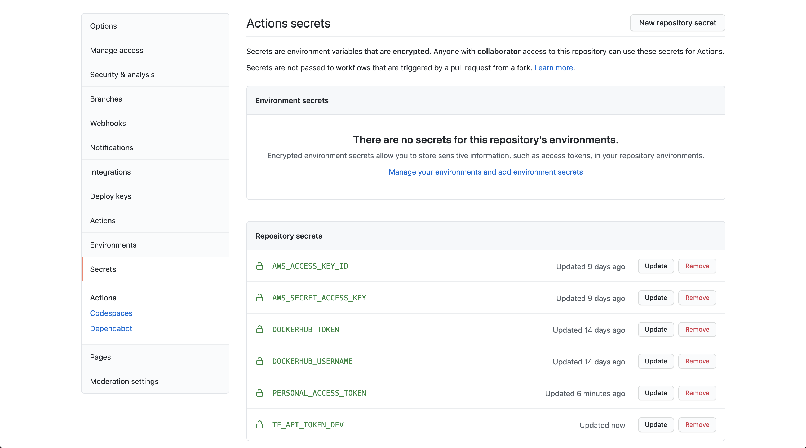

# Workflows

## build

What docker tags will be produced and when?  It depends on the trigger.  

Doc: https://github.com/docker/metadata-action#basic (the following is a summary of the doc)

| Event           | Ref                           | Docker Tags                         |
|-----------------|-------------------------------|-------------------------------------|
| `pull_request`  | `refs/pull/2/merge`           | `pr-2`                              |
| `push`          | `refs/heads/main`             | `main`                              |
| `push`          | `refs/heads/releases/v1`      | `releases-v1`                       |
| `push tag`      | `refs/tags/v1.2.3`            | `v1.2.3`, `latest`                  |
| `push tag`      | `refs/tags/v2.0.8-beta.67`    | `v2.0.8-beta.67`, `latest`          |

### Open a pull request
Opening a pull request will create a docker container with a tag named after the PR #

### Pushing a tag:

Create the tag:
```
git tag -a v1.4.2 -m "my version 1.4.2"
```

Push the tag to the repository:
```
git push origin v1.4.2
```

This will create these tags for the container:
* v1.4.2
* latest

## Deploy
On tag, the deployment will run.

Based on semver: `major.minor.patch`

| Changes         | Deploy to              | 
|-----------------|------------------------|
| `patch`         | `dev`                  |
| `minor`         | `staging`              |
| `major`         | `production`           |


## Performing a release from dev to prod
The idea here is that we will cut a release and produce one Docker container artifact with this
release version.  This release version will be deployed to dev then promoted along the way, all
the way into prod if all of our testing checks out.

example release tag: v1.1.1
* Manual: Git push tag v1.1.1
* Automated: docker container build
* Automated: deploy to dev
* Automated: update the dev's docker image tag
* Manual: test dev
* Manual: everything is good

Promote v1.1.1 to staging
* Manual: Change the staging's docker image tag to this manually?
* Manual: Open PR and get it merged
* Automated: deploy to staging
* Manual: test staging
* Manual: everything is good

Promote v1.1.1 to prod
* Manual: Change the prod's docker image tag to this manually?
* Manual: Open PR and get it merged
* Automated: Deploy to prod
* Manual: test prod
* Manual: everything is good

## Github Actions Secrets
For the Github Action pipeline's to work correctly, it will need a few secrets to access your various external resources like AWS or Docker hub.

* AWS_ACCESS_KEY_ID
* AWS_SECRET_ACCESS_KEY
  * AWS credentials
* DOCKERHUB_TOKEN
* DOCKERHUB_USERNAME
  * Dockerhub credentials
* PERSONAL_ACCESS_TOKEN
  * A Github personal access token.  This is used so that when a Github Actions commits the updated docker tags for the deploys, it will trigger the Terraform deploy pipeline.  Without an authenticated user, Github Actions pipelines will not trigger a new Action run even if all of the Github Action criteria are matched.
* TF_API_TOKEN_DEV
  * Terraform cloud token


